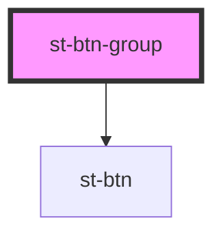

# st-btn-group

<!-- Auto Generated Below -->

## Properties

| Property         | Attribute | Description | Type                       | Default                            |
| ---------------- | --------- | ----------- | -------------------------- | ---------------------------------- |
| `btns`           | --        |             | `string[]`                 | `["RENDER ME THIS", "Numero Dos"]` |
| `display`        | `display` |             | `string`                   | `undefined`                        |
| `onClickHandler` | --        |             | `(target: string) => void` | `this.clickHandler`                |

## Dependencies

### Depends on

- [st-btn](../st-btn)

### Graph

----------------------------------------------

*Built with [StencilJS](https://stenciljs.com/)*
