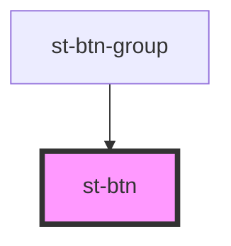

# st-btn

<!-- Auto Generated Below -->

## Properties

| Property         | Attribute | Description | Type                        | Default     |
| ---------------- | --------- | ----------- | --------------------------- | ----------- |
| `display`        | `display` |             | `string`                    | `undefined` |
| `onClickHandler` | --        |             | `(btnName: string) => void` | `undefined` |

## Dependencies

### Used by

 - [st-btn-group](../st-btn-group)

### Graph

----------------------------------------------

*Built with [StencilJS](https://stenciljs.com/)*
